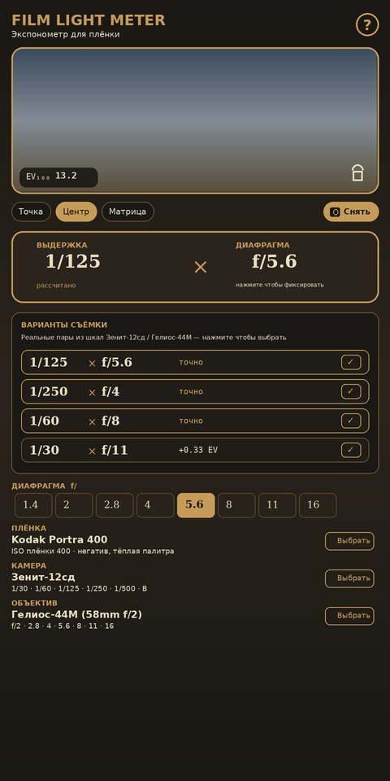
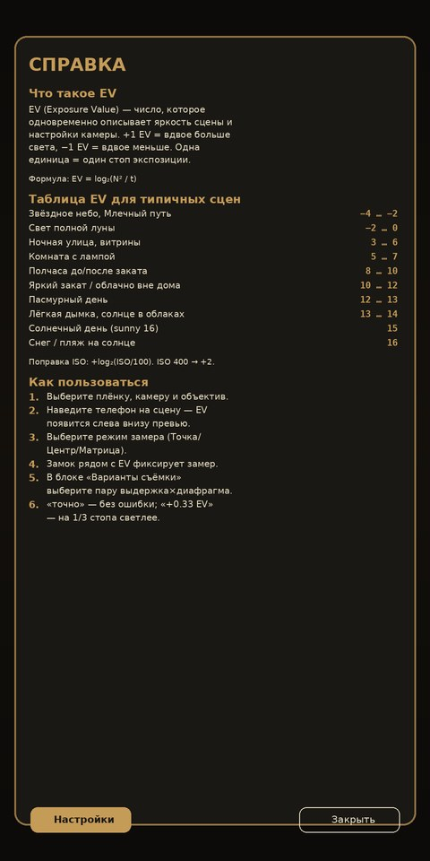

# FilmLightMeter

**Экспонометр для плёночной фотографии под Android.** Используйте камеру телефона вместо отдельного Sekonic — приложение замеряет яркость сцены, знает характеристики популярных плёнок и выдаёт готовую экспопару для вашей плёночной камеры.

[](https://github.com/Dnlln/FilmLightMeter/releases/latest)
[](https://github.com/Dnlln/FilmLightMeter/releases)
[](https://kotlinlang.org)
[](https://developer.android.com/jetpack/compose)
[](./LICENSE)

<p align="center">
  
  &nbsp;&nbsp;
  
</p>

<p align="center">
  <sub><b>Слева:</b> главный экран с подбором пар из шкал Зенит-12сд и Гелиос-44М. <b>Справа:</b> диалог справки с таблицей EV для типичных сцен.</sub>
</p>

## 📷 Зачем это нужно

Снимаете на **Зенит, Смена, Nikon FM2, Leica M6, Pentax K1000**? Ваш экспонометр покойный или его никогда и не было? Цифровая камера с собой не всегда. Мобильные экспонометры типа Sekonic стоят как сама плёночная тушка.

Этот проект закрывает задачу: точный замер через камеру телефона, профили настоящих плёнок, всё в режиме ретро-интерфейса настольного лабораторного экспонометра.

## ✨ Возможности

- 🎯 **Три режима замера**: точечный (центр кадра), центровзвешенный (с радиальным спадом весов), матричный (равномерная сетка 3×3)
- 🎞️ **31 пресет плёнок** с индивидуальными параметрами: Kodak Portra 160/400/800, Ektar 100, Gold 200, Tri-X 400, T-Max 100/400/P3200, Ilford HP5+, FP4+, Delta 100/400/3200, Pan F, XP2, Fomapan 100/400, Fuji Velvia 50/100, Provia 100F, Superia X-Tra 400, C200, Cinestill 400D/800T, Lomo 400, Harman Phoenix 200, Kodak Ektachrome E100 и другие
- 📸 **9 пресетов плёночных камер** — Зенит-12сд (по умолчанию), ФЭД-2, ФЭД-5, Смена-8М, Pentax K1000, Nikon FM2, Leica M6, Canon AE-1 + универсальная шкала. Приложение знает реальный набор выдержек и наличие режима B
- 🔭 **9 пресетов объективов** — Гелиос-44М (по умолчанию), Индустар-50-2, Юпитер-37А, Юпитер-9, Мир-1, Таир-11А, Триплет-78, Nikkor (полустопы), универсальная шкала
- 🎯 **Варианты съёмки** — приложение автоматически показывает 3–4 реальные пары выдержка × диафрагма из шкал выбранной камеры и объектива, с пометкой «точно» или сдвигом «±EV». Нажатие выбирает пару в один тап
- ❓ **Встроенная справка** с таблицей EV для типичных сцен и пошаговой инструкцией
- 📷 **Скриншот одной кнопкой** — кнопка «Снять» сохраняет кадр в галерею (для записи параметров к плёнке)
- ⚙️ **Ручной ISO** с шкалой 25–6400 и режимом AUTO (брать ISO из плёнки)
- 🔒 **Заморозка замера** — замерили один раз, двигаетесь с камерой спокойно
- 🎚️ **Приоритет диафрагмы / выдержки** — фиксируйте одно, приложение пересчитает другое
- ➕ **Компенсация ±EV** с шагом 1/3 стопа (push/pull, творческая недо-/передержка)
- 🌘 **ND-фильтры** — учёт плотности любого фильтра в стопах
- ⏱️ **Коррекция закона взаимности** (reciprocity failure) для длинных выдержек — плёнка теряет чувствительность при t > 1 с, и это учитывается индивидуально для каждой плёнки
- 🎛️ **Калибровка ±EV** для точной подстройки под ваш смартфон
- 🎨 **Ретро-интерфейс** в стиле Sekonic L-398: латунные акценты, кремовый текст, глубокая кожаная подложка

## 📥 Установка

1. Скачайте `app-release.apk` из [последнего релиза](https://github.com/Dnlln/FilmLightMeter/releases/latest)
2. На Android разрешите установку из неизвестных источников (Настройки → Безопасность)
3. Откройте APK и установите
4. При первом запуске разрешите доступ к камере

**Минимальные требования:** Android 7.0 (API 24) и выше. Приложение не собирает и не отправляет никаких данных.

## 🧮 Математика: как считается экспозиция

Приложение использует систему **APEX** (Additive System of Photographic Exposure) — тот же формализм, что применяется в плёночных экспонометрах и в [стандарте ISO 2720](https://www.iso.org/standard/7690.html) для ручных люксометров.

### Экспозиционное число (EV)

Связывает выдержку, диафрагму и «количество света» одной величиной — каждая единица EV соответствует удвоению/уполовиниванию света:

$$\mathrm{EV} = \log_2\!\left(\frac{N^2}{t}\right) = A_v + T_v$$

где *N* — диафрагма (f-число), *t* — выдержка в секундах. При ISO 100 значение EV ≈ 0 соответствует примерно лунной ночи, EV = 15 — яркому солнцу над снегом.

### Связь EV со сценой

При заданной яркости сцены *L* (кд/м²) и чувствительности *S* (ISO) правильный EV равен:

$$\mathrm{EV}_{S} = \log_2\!\left(\frac{L \cdot S}{K}\right)$$

Константа *K* для отражённого света = **12.5** (калибровка Sekonic/Minolta, рекомендуется [ISO 2720](https://www.iso.org/standard/7690.html)). Приложение пересчитывает к нормированному ISO 100:

$$\mathrm{EV}_{100} = \mathrm{EV}_{S} - \log_2\!\left(\frac{S}{100}\right)$$

### Как мы получаем *EV* из камеры телефона

Телефон в автоэкспозиции сам выставляет свои *N*, *t*, *S*, чтобы кадр был среднесерым. Эти параметры мы читаем через `SENSOR_EXPOSURE_TIME`, `SENSOR_SENSITIVITY`, `LENS_APERTURE` из [`Camera2.CaptureResult`](https://developer.android.com/reference/android/hardware/camera2/CaptureResult). Если телефон снял кадр с параметрами *N₀, t₀, S₀* и кадр действительно вышел среднесерым — значит, сцена соответствует этому же EV. Если средняя яркость Y-канала отличается от целевого среднего серого *Y₀* = 118 (≈ 18 % в гамме sRGB), добавляем поправку:

$$\mathrm{EV}_{100} = \log_2\!\left(\frac{N_0^{\,2}}{t_0}\right) - \log_2\!\left(\frac{S_0}{100}\right) + \log_2\!\left(\frac{\bar Y}{Y_0}\right)$$

Средняя яркость $\bar Y$ считается не по всему кадру, а по выбранной **зоне замера** — точка, центровзвешенный круг или 3×3-матрица.

### Обратный расчёт экспопары

Зная *EV₁₀₀* и ISO вашей плёнки *S*, приложение выдаёт недостающий параметр:

$$t = \frac{N^2}{2^{\,\mathrm{EV}_{S}}}, \qquad N = \sqrt{\,t \cdot 2^{\,\mathrm{EV}_{S}}\,}$$

Затем результат округляется к ближайшему значению на шкале камеры (стандартные стопы: 1, 1.4, 2, 2.8, 4, 5.6, 8, 11, 16, 22, 32 — и выдержки 1/1000, 1/500, …, 1, 2, 4 с).

### Закон взаимности (reciprocity failure)

При длинных выдержках плёнка теряет чувствительность нелинейно — это знаменитый эффект, из-за которого ночные кадры на Tri-X получаются недосвеченными, если не добавить экспозицию. Аппроксимируем степенной функцией:

$$t_{\text{real}} = t^{\,p}, \quad t > 1\text{ с}$$

Параметр *p* индивидуален для каждой плёнки (по техническим листам производителей): Velvia/Provia — 1.00 (слайды почти не страдают), Portra — 1.33, Tri-X — 1.33, HP5+ — 1.31, T-Max — 1.20, Fomapan — 1.30. Включается в настройках (⚙).

## 💡 Что такое EV и как им пользоваться

**EV** (Exposure Value) — число, которое одновременно описывает яркость сцены и настройки камеры. **+1 EV = вдвое больше света**, −1 EV = вдвое меньше. Одна единица EV = один стоп экспозиции.

В приложении всегда показывается $EV_{100}$ — значение приведено к ISO 100. Для другого ISO добавьте $\log_2(ISO/100)$: ISO 200 → +1, ISO 400 → +2, ISO 800 → +3.

### Таблица EV для типичных сцен

| Сцена | EV₁₀₀ |
|-------|--------|
| Звёздное небо, Млечный путь | −4 … −2 |
| Свет полной луны | −2 … 0 |
| Ночная улица, витрины | 3 … 6 |
| Комната с лампой | 5 … 7 |
| Полчаса до/после заката | 8 … 10 |
| Яркий закат / облачно вне дома | 10 … 12 |
| Пасмурный день | 12 … 13 |
| Лёгкая дымка, солнце в облаках | 13 … 14 |
| Солнечный день (sunny 16) | **15** |
| Снег / пляж на солнце | 16 |

Эта же таблица доступна в приложении по кнопке **❓** в правом верхнем углу.

## 🧑‍💻 Использование

1. **Выберите плёнку, камеру и объектив** — приложение ограничит расчёт их реальными выдержками и диафрагмами (по умолчанию — Зенит-12сд с Гелиос-44М)
2. **Выберите режим замера** — Точка / Центр / Матрица
3. **Направьте телефон на сцену или серую карту** — в левом углу превью появится EV₁₀₀
4. **Нажмите 🔒** рядом с EV, чтобы зафиксировать замер — можно перенаправить телефон и спокойно компоновать кадр
5. **В блоке «Варианты съёмки»** появятся 3–4 реальные пары выдержка × диафрагма. Нажмите на подходящую — значения подставятся в экспопару вверху
6. **Переведите эту пару на камере** и снимайте. Метка «точно» — пара попадает в EV без ошибки. «+0.33 EV» — кадр будет на 1/3 стопа светлее идеала

Полезные мелочи:
- Пока выбран режим «Подгонять под шкалу камеры», выдержки в замену диафрагмы берутся только из набора выбранной камеры
- Если выдержки камеры не хватает, приложение предложит режим **B** (долгая выдержка от руки) или подскажет, что нужен ND-фильтр
- Ручной ISO (шкала ISO) позволяет снимать плёнку на нестандартной чувствительности (push/pull)
- Кнопка **«Снять»** сохраняет скриншот экрана в галерею — удобно, чтобы записать параметры кадра к плёнке
- В справке (❓) есть **Калибровка** — сдвиг EV на ±стопы для компенсации особенностей камеры вашего телефона
- ND-фильтр — просто укажите плотность в стопах, и выдержка пересчитается

## 🏗️ Сборка

### Через GitHub Actions (автоматически)

Каждый push в `main` собирает APK — доступны как Artifacts в [Actions](https://github.com/Dnlln/FilmLightMeter/actions). Пуш тега `vX.Y.Z` создаёт релиз и прикрепляет `app-debug.apk` и `app-release.apk`.

### Локально

```bash
git clone https://github.com/Dnlln/FilmLightMeter.git
cd FilmLightMeter
./gradlew :app:assembleRelease
# APK: app/build/outputs/apk/release/app-release.apk
```

Требования: JDK 17+, Android SDK 34 (Gradle 8.7 подтянется через wrapper).

## 🗺️ Архитектура

```
app/src/main/java/com/filmlightmeter/app/
├── MainActivity.kt              — точка входа, разрешение камеры
├── exposure/ExposureMath.kt     — формулы APEX, подгонка под шкалы камеры, алгоритм findBestPairs
├── data/
│   ├── FilmPresets.kt           — 31 плёнка с параметрами взаимности
│   ├── CameraPresets.kt         — 9 плёночных камер (выдержки, режим B)
│   └── LensPresets.kt           — 9 объективов с дискретными диафрагмами
├── camera/
│   ├── LuminanceAnalyzer.kt     — анализ Y-канала YUV, 3 режима замера
│   └── CameraExposureProbe.kt   — чтение SENSOR_EXPOSURE_TIME / SENSITIVITY
├── util/ScreenCapture.kt        — PixelCopy скриншот + MediaStore
└── ui/
    ├── MeterViewModel.kt        — состояние + сглаживающий фильтр EV, bestPairs()
    ├── theme/Theme.kt           — ретро-палитра (кожа, латунь, крем)
    ├── components/              — превью, шкалы
    └── screens/MeterScreen.kt   — главный экран, диалог справки, ExposurePairsCard
```

Стек: **Kotlin 1.9.24 · Jetpack Compose · CameraX 1.3.4 · Camera2 Interop · AGP 8.5.2**.

## 🤝 Вклад

Issues и PR приветствуются. Подробное руководство — в [CONTRIBUTING.md](./CONTRIBUTING.md).

### Если нашли баг

Откройте [новый issue](https://github.com/Dnlln/FilmLightMeter/issues/new/choose) и выберите шаблон:

- **🐛 Баг-репорт** — неверная экспопара, вылет, проблемы UI
- **💡 Запрос на фичу** — идеи новых функций
- **🎞️ Новый пресет** — плёнка, камера или объектив, которых пока нет в приложении

К баг-репорту приложите скриншот — кнопка «Снять» в приложении сохраняет его в галерею одним тапом.

### Хорошие направления для PR

- Калибровочные данные для конкретных моделей телефонов
- Новые плёнки (экзотика: Kodachrome-реплики, Adox, Rollei)
- Журнал съёмки (сохранение кадров с параметрами и геометкой)
- Инкидентный замер (по белой полусфере)
- Зоны Ансела Адамса

Крупные изменения лучше сначала обсудить в issue — сэкономит время.

## 📄 Лицензия

[MIT](./LICENSE). Используйте, форкайте, улучшайте.

---

*Сделано с любовью к плёнке. Если приложение помогло вам сэкономить на Sekonic — поставьте ⭐ на GitHub.*
